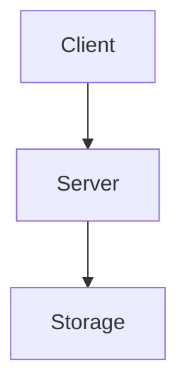

# rLightning Documentation

This directory contains the source files for the rLightning documentation site, built with [MkDocs Material](https://squidfunk.github.io/mkdocs-material/).

## Quick Start

### Prerequisites

- Python 3.7 or higher
- pip

### Install Dependencies

```bash
pip install mkdocs-material mkdocs-minify-plugin
```

### Serve Locally

```bash
# From this directory
mkdocs serve

# Access at http://localhost:8000
```

### Build Static Site

```bash
mkdocs build

# Output in site/ directory
```

## Directory Structure

```
site/
├── mkdocs.yml           # MkDocs configuration
├── docs/                # Documentation source files
│   ├── index.md         # Homepage
│   ├── getting-started.md
│   ├── quick-start.md
│   ├── configuration.md
│   ├── architecture.md
│   ├── use-cases.md
│   ├── commands/        # Command reference
│   │   └── index.md
│   ├── stylesheets/
│   │   └── extra.css    # Custom CSS
│   ├── favicon.svg      # Site favicon
│   ├── icon.png         # Site icon
│   └── logo.png         # Site logo
└── overrides/           # Theme overrides (optional)
```

## Writing Documentation

### Adding a New Page

1. Create a new `.md` file in the appropriate directory
2. Add the page to `mkdocs.yml` under the `nav` section
3. Write your content using Markdown

### Markdown Extensions

The site supports many Markdown extensions:

#### Code Blocks

````markdown
```python
def hello():
    print("Hello, rLightning!")
```
````

#### Admonitions

```markdown
!!! note
    This is a note

!!! warning
    This is a warning

!!! tip
    This is a tip
```

#### Tabs

```markdown
=== "Python"
    ```python
    print("Hello")
    ```

=== "JavaScript"
    ```javascript
    console.log("Hello");
    ```
```

#### Tables

```markdown
| Command | Description |
|---------|-------------|
| GET     | Get value   |
| SET     | Set value   |
```

#### Mermaid Diagrams

````markdown

````

## Styling

### Custom CSS

Custom styles are in `docs/stylesheets/extra.css`. The site uses CSS variables for theming:

```css
:root {
  --rl-primary: #FF6B35;
  --rl-secondary: #F7931E;
  --rl-accent: #FF8C42;
}
```

### Icons and Logos

- `favicon.svg` - Browser favicon (SVG format)
- `icon.png` - Site icon for navigation (PNG, 512x512)
- `logo.png` - Full logo with text (PNG, wider format)

## Configuration

### mkdocs.yml

Key configuration sections:

- `site_name`, `site_url` - Basic site info
- `theme` - Material theme settings
- `nav` - Navigation structure
- `markdown_extensions` - Enabled Markdown features
- `plugins` - MkDocs plugins

## Deployment

### Docker

Build and run the documentation container:

```bash
# From project root
docker build -f Dockerfile.site -t rlightning-docs .
docker run -d -p 8080:8080 rlightning-docs
```

Or use docker-compose:

```bash
docker-compose -f docker-compose.docs.yml up -d
```

### GitHub Pages

The documentation is automatically deployed to GitHub Pages via GitHub Actions when changes are pushed to the `main` branch.

Workflow file: `.github/workflows/docs.yml`

### Manual Deployment

```bash
# Build the site
mkdocs build

# Deploy to GitHub Pages
mkdocs gh-deploy
```

## Development Tips

### Live Reload

MkDocs includes live reload - changes to markdown files are immediately reflected in the browser.

### Strict Mode

Build with `--strict` to fail on warnings:

```bash
mkdocs build --strict
```

### Local Testing

Before pushing changes:

1. Build locally: `mkdocs build --strict`
2. Check for broken links
3. Test on mobile viewport
4. Verify all navigation works

## Useful Commands

```bash
# Start dev server
mkdocs serve

# Build site
mkdocs build

# Build with strict checking
mkdocs build --strict

# Deploy to GitHub Pages
mkdocs gh-deploy

# Show version
mkdocs --version

# Get help
mkdocs --help
```

## Using the Build Script

A convenience script is available at `../scripts/build-docs.sh`:

```bash
# Serve with live reload
./scripts/build-docs.sh --serve

# Build static site
./scripts/build-docs.sh --build

# Build Docker image
./scripts/build-docs.sh --docker

# Run in Docker
./scripts/build-docs.sh --docker --run

# Install dependencies
./scripts/build-docs.sh --install-deps

# Clean build artifacts
./scripts/build-docs.sh --clean
```

## Contributing

When contributing documentation:

1. Follow the existing structure and style
2. Use clear, concise language
3. Include code examples where appropriate
4. Test locally before submitting
5. Update navigation in `mkdocs.yml` if adding pages

## Resources

- [MkDocs Documentation](https://www.mkdocs.org/)
- [Material for MkDocs](https://squidfunk.github.io/mkdocs-material/)
- [Markdown Guide](https://www.markdownguide.org/)
- [Python-Markdown Extensions](https://python-markdown.github.io/extensions/)

## Troubleshooting

### Port Already in Use

If port 8000 is already in use:

```bash
mkdocs serve -a localhost:8001
```

### Missing Dependencies

```bash
pip install -r requirements.txt
# or
pip install mkdocs-material mkdocs-minify-plugin
```

### Build Errors

Check for:
- Syntax errors in markdown files
- Missing images or links
- Invalid YAML in mkdocs.yml
- Missing pages referenced in navigation

Run with verbose output:

```bash
mkdocs build --verbose
```
