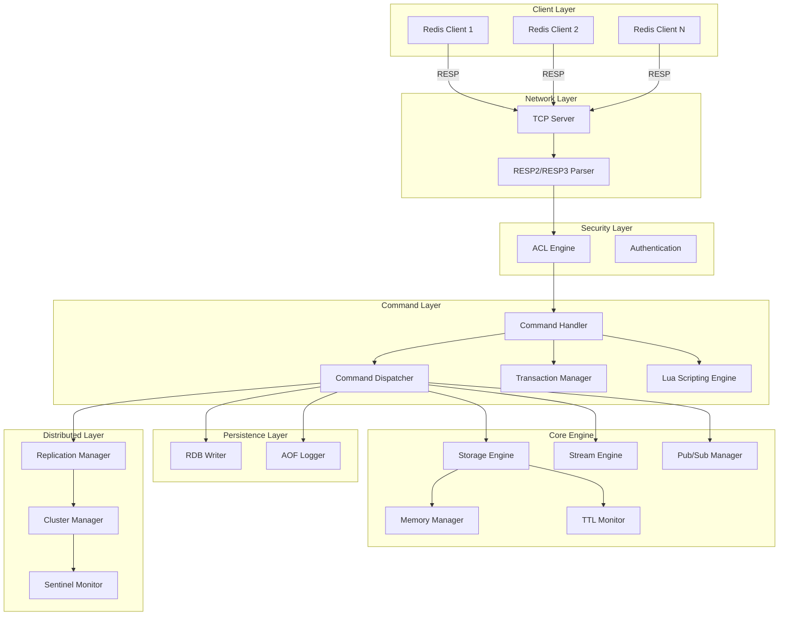
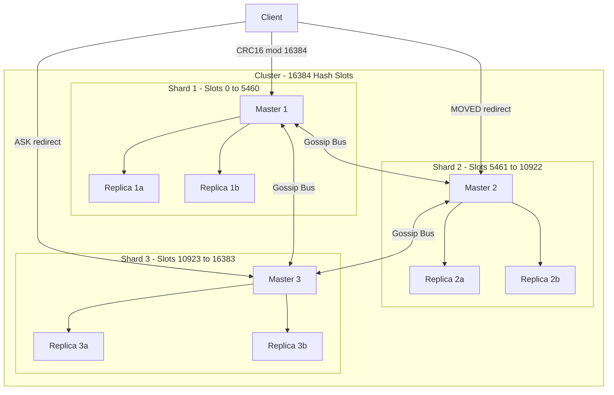
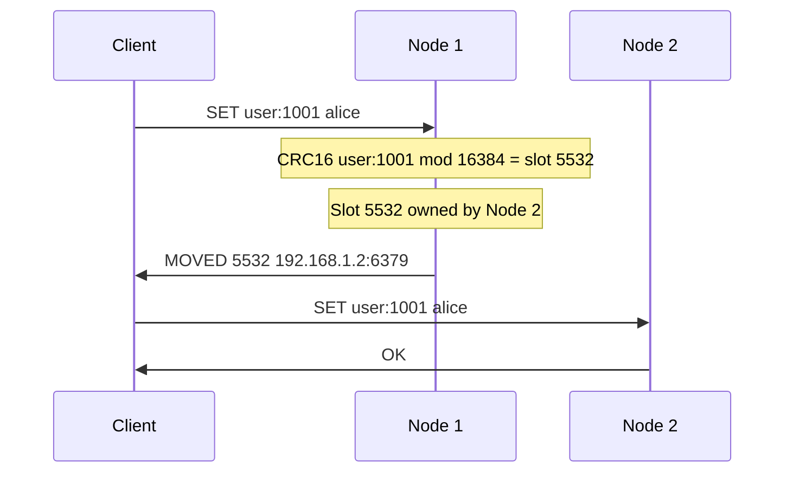
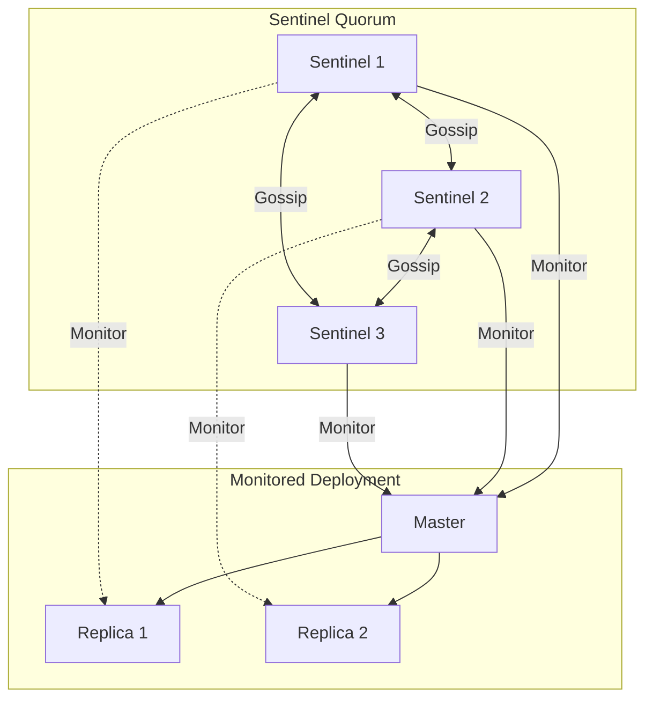
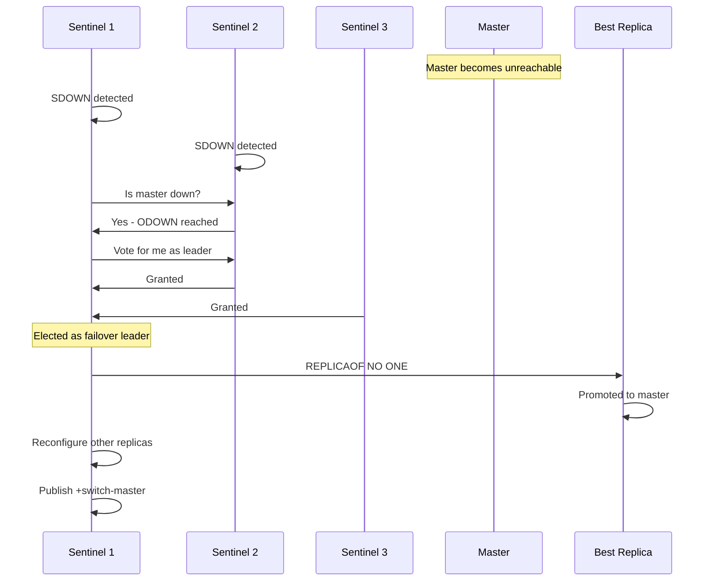
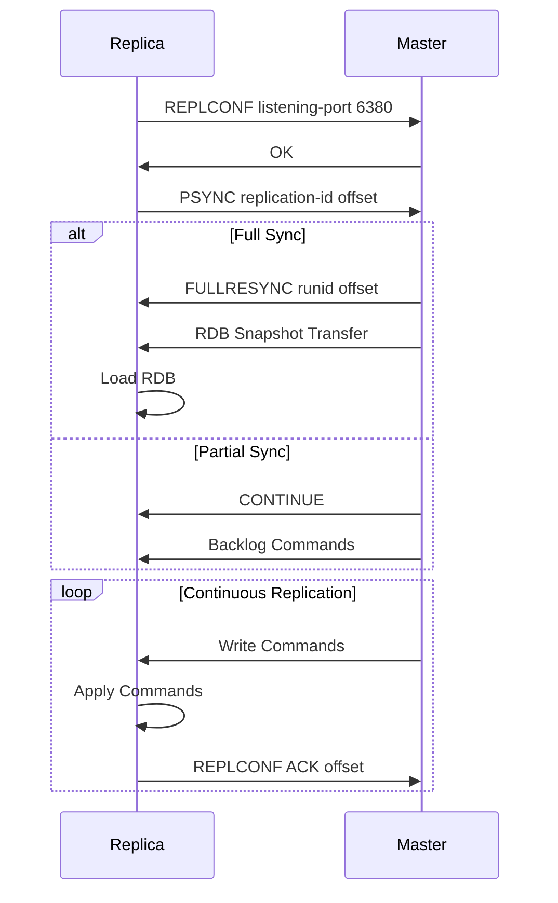

# Architecture

rLightning is designed with performance, safety, and maintainability in mind. This document provides an overview of the system architecture.

## High-Level Architecture



## Core Components

### 1. Network Layer

**Location**: `src/networking/`

Handles all network communication using both RESP2 and RESP3 protocols.

#### TCP Server
- Built on Tokio async runtime
- Handles concurrent client connections
- Per-connection protocol version tracking (RESP2/RESP3)

#### RESP Parser
- Supports all RESP2 and RESP3 data types
- RESP3: Map, Set, Null, Boolean, Double, Big Number, Verbatim String, Push
- Protocol negotiation via HELLO command

### 2. Security Layer

**Location**: `src/security/`

#### ACL Engine
- Per-user command permissions, key patterns, and channel restrictions
- Command category-based rules (+@read, -@write)
- Integrated into command dispatch pipeline

#### Authentication
- Password-based authentication (AUTH)
- Named user authentication (AUTH username password)
- Client session tracking

### 3. Command Processing Layer

**Location**: `src/command/`

#### Command Dispatcher
- Routes commands to handlers
- Validates command arguments
- Enforces ACL permissions

#### Transaction Manager (`src/command/transaction.rs`)
- MULTI/EXEC command queuing
- WATCH-based optimistic locking with key versioning
- Atomic execution with per-command error isolation

#### Lua Scripting Engine (`src/scripting/`)
- Lua 5.1 via mlua
- redis.call() and redis.pcall() bindings
- Script caching (EVALSHA)
- Redis 7.0 Functions (FCALL)
- Atomic execution (no other commands during script)

### 4. Storage Engine

**Location**: `src/storage/`

Uses `DashMap` for lock-free concurrent access with fine-grained internal sharding.

#### Supported Data Types
- **String**: Binary-safe strings
- **Hash**: Field-value pairs
- **List**: Double-ended queue
- **Set**: Hash set of unique values
- **Sorted Set**: Skip list with scores
- **Stream**: Radix tree with consumer groups
- **HyperLogLog**: Sparse and dense representations
- **Bitmap**: Bit-level operations on strings

#### Memory Management
- Configurable limits with LRU, Random, and No Eviction policies
- Real-time tracking via MEMORY USAGE/STATS
- Lazy expiration on access + periodic background cleanup

### 5. Persistence Layer

**Location**: `src/persistence/`

#### RDB (Redis Database)
- Point-in-time snapshots with background save
- Atomic writes with temp files

#### AOF (Append-Only File)
- Configurable sync: always, everysec, no
- Background rewrite for compaction

#### Hybrid Mode
- RDB for fast restarts + AOF for durability

### 6. Pub/Sub System

**Location**: `src/pubsub/`

- Channel and pattern subscriptions (SUBSCRIBE, PSUBSCRIBE)
- Sharded pub/sub (SSUBSCRIBE, SPUBLISH) for Redis 7.0+ compatibility
- Real-time message broadcasting

### 7. Stream Engine

**Location**: `src/storage/stream.rs`

- Append-only log with auto-generated entry IDs
- Consumer groups with pending entry lists (PEL)
- Blocking reads (XREAD BLOCK, XREADGROUP BLOCK)
- Trimming (MAXLEN, MINID)

## Cluster Architecture



**Location**: `src/cluster/`

### Key Components

- **Hash Slot Calculation**: CRC16 mod 16384 with hash tag support (`{tag}`)
- **Gossip Protocol**: Inter-node communication on port+10000
- **Slot Assignment**: Epoch-based versioning for consistency
- **Redirections**: MOVED (permanent) and ASK (temporary) for cross-slot operations
- **Slot Migration**: IMPORTING/MIGRATING states with MIGRATE command
- **Automatic Failover**: Detection and replica promotion

### Cluster Data Flow



## Sentinel Architecture



**Location**: `src/sentinel/`

### Key Components

- **Master Monitoring**: Configurable quorum-based down detection
- **SDOWN/ODOWN**: Subjective and Objective Down states
- **Leader Election**: Raft-like election for failover coordination
- **Automatic Failover**: Replica selection, promotion, and reconfiguration
- **Configuration Provider**: Clients query Sentinel for current master address

### Failover Sequence



## Replication Flow



## Concurrency Model

- **Async Runtime**: Tokio with work-stealing scheduler
- **Lock-Free Storage**: DashMap with fine-grained internal sharding
- **Thread Safety**: `Arc<T>`, interior mutability, atomic operations
- **Blocking Commands**: Per-key wait queues with client wakeup mechanism

## Technology Stack

- **Language**: Rust 2024 Edition
- **Async Runtime**: Tokio
- **Concurrency**: DashMap, parking_lot
- **Scripting**: mlua (Lua 5.1)
- **Serialization**: bincode, serde
- **Memory**: jemalloc
- **CLI**: clap
- **Configuration**: figment

## Code Organization

```
src/
  main.rs              # Entry point
  networking/           # RESP2/RESP3 protocol, TCP server
  command/              # Command handlers and dispatch
    types/              # Per-type command implementations
    transaction.rs      # MULTI/EXEC
  storage/              # Storage engine, data types
    engine.rs           # Core storage
    stream.rs           # Stream data structure
  persistence/          # RDB/AOF
  replication/          # Master-replica sync
  security/             # Authentication, ACL
    acl.rs              # Access Control Lists
  pubsub/               # Pub/Sub messaging
  scripting/            # Lua scripting engine
  cluster/              # Cluster mode
    slot.rs             # Hash slot management
    gossip.rs           # Cluster bus protocol
    migration.rs        # Slot migration
  sentinel/             # Sentinel HA
    monitor.rs          # Master monitoring
    failover.rs         # Automatic failover
  module/               # Module system stubs
```

## Learn More

- [Storage Engine Details](storage-engine.md)
- [Networking Layer](networking.md)
- [Command Processing](command-processing.md)
- [Performance Benchmarks](benchmarks.md)
