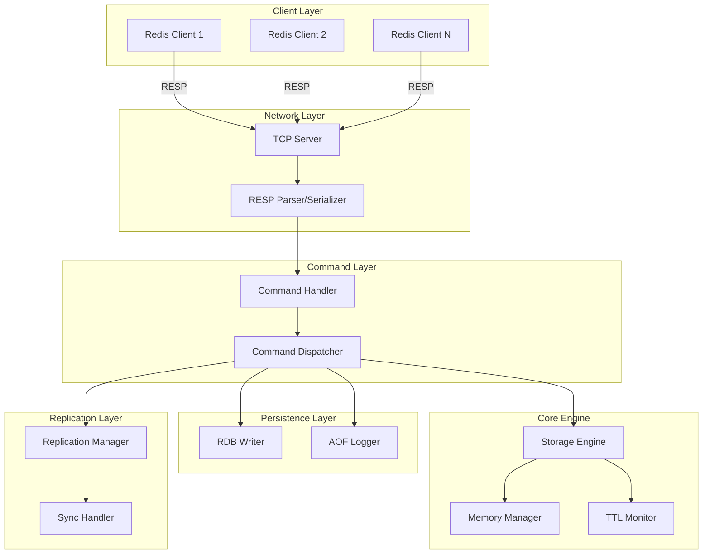
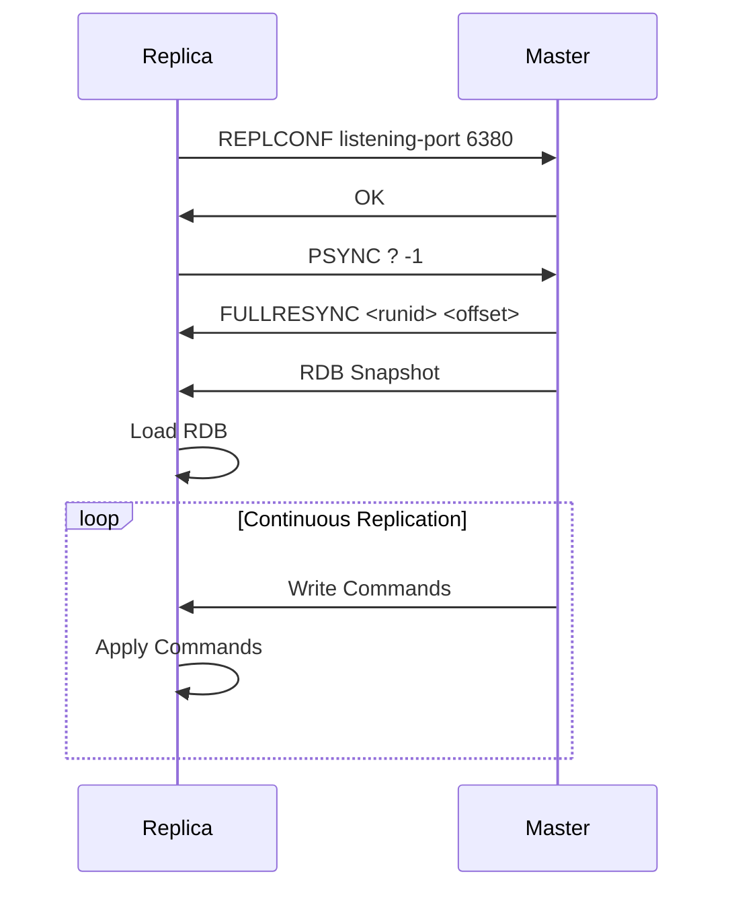
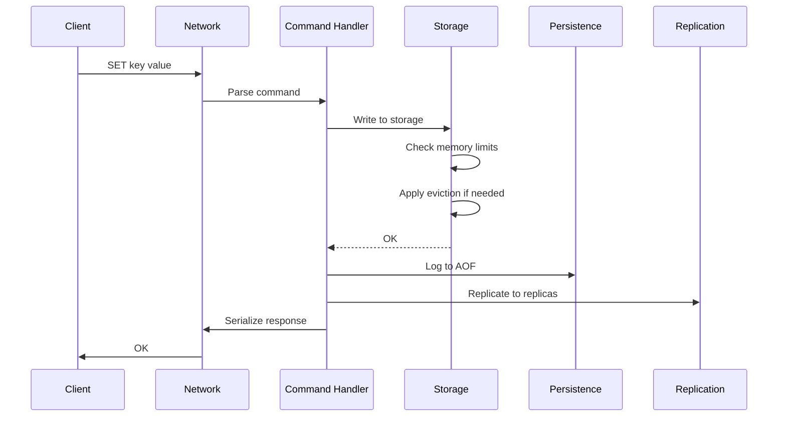
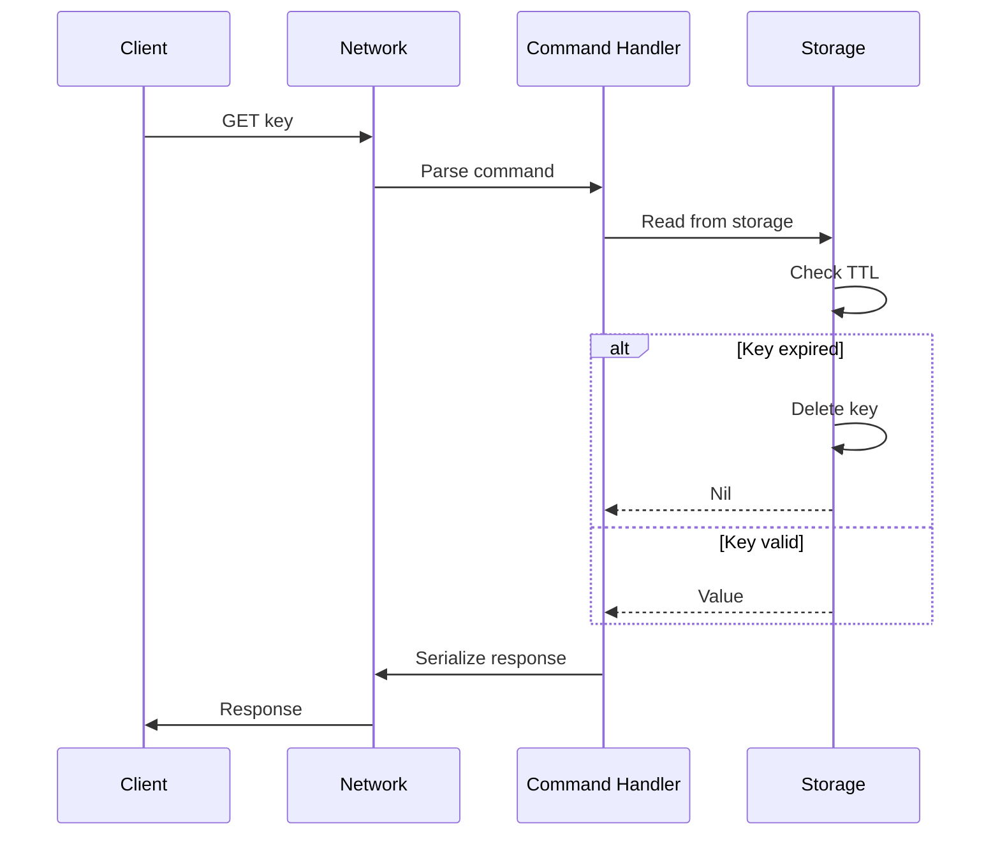

# Architecture

rLightning is designed with performance, safety, and maintainability in mind. This document provides an overview of the system architecture.

## High-Level Architecture



## Core Components

### 1. Network Layer

**Location**: `src/networking/`

Handles all network communication using the Redis Serialization Protocol (RESP).

#### TCP Server
- Built on Tokio async runtime
- Handles concurrent client connections
- Connection pooling and management

#### RESP Parser
- Parses RESP protocol messages
- Supports all RESP data types:
  - Simple Strings
  - Errors
  - Integers
  - Bulk Strings
  - Arrays

#### RESP Serializer
- Serializes responses back to RESP format
- Efficient zero-copy where possible

### 2. Command Processing Layer

**Location**: `src/command/`

Processes incoming commands and dispatches them to appropriate handlers.

#### Command Handler
```rust
pub trait CommandHandler {
    async fn handle(&self, args: Vec<Value>) -> Result<Value>;
}
```

Each command has its own handler implementation.

#### Command Dispatcher
- Routes commands to handlers
- Validates command arguments
- Handles errors and responses
- Thread-safe command execution

### 3. Storage Engine

**Location**: `src/storage/`

The heart of rLightning, managing all data operations.

#### Data Structure
Uses `DashMap` for lock-free concurrent access:

```rust
pub struct Storage {
    data: DashMap<Key, Entry>,
    memory_manager: MemoryManager,
    ttl_monitor: TtlMonitor,
}
```

#### Supported Data Types
- **String**: Binary-safe strings
- **Hash**: Field-value pairs
- **List**: Linked list implementation
- **Set**: Hash set of unique values
- **Sorted Set**: Skip list with scores

#### Memory Management
- Configurable memory limits
- Eviction policies (LRU, Random, No Eviction)
- Real-time memory tracking
- Efficient memory allocation with jemalloc

#### TTL Monitor
- Background thread for expiration
- Efficient expiration checking
- Lazy expiration on access
- Periodic cleanup of expired keys

### 4. Persistence Layer

**Location**: `src/persistence/`

Ensures data durability through various persistence strategies.

#### RDB (Redis Database)
- Point-in-time snapshots
- Binary format for efficiency
- Configurable save intervals
- Background save operations
- Atomic writes with temp files

#### AOF (Append-Only File)
- Logs every write operation
- Configurable sync strategies:
  - `always`: Sync after every write
  - `everysec`: Sync every second
  - `no`: Let OS decide
- AOF rewrite for compaction

#### Hybrid Mode
- Combines RDB and AOF
- RDB for fast restarts
- AOF for durability
- Best of both worlds

### 5. Replication Layer

**Location**: `src/replication/`

Enables master-replica setup for high availability and read scaling.

#### Replication Manager
- Manages replica connections
- Propagates writes to replicas
- Handles disconnections and reconnections

#### Sync Handler
- Full synchronization (SYNC)
- Partial synchronization (PSYNC)
- Incremental updates

#### Replication Flow


### 6. Security Layer

**Location**: `src/security/`

Manages authentication and authorization.

#### Authentication
- Password-based authentication
- Client session tracking
- AUTH command implementation

## Data Flow

### Write Operation Flow



### Read Operation Flow



## Concurrency Model

### Async Runtime
- Built on **Tokio** async runtime
- Non-blocking I/O operations
- Efficient task scheduling

### Lock-Free Storage
- **DashMap** for concurrent access
- Fine-grained internal locking
- Minimal contention

### Thread Safety
All components are designed to be thread-safe:
- Shared state uses `Arc<T>`
- Mutations use interior mutability (`RwLock`, `Mutex`)
- Atomic operations where possible

## Performance Optimizations

### Memory Efficiency
- **jemalloc** allocator for better memory management
- Efficient data structures
- Zero-copy operations where possible

### Network Efficiency
- Connection pooling
- Buffered I/O
- Efficient RESP parsing

### Storage Efficiency
- Lock-free concurrent access
- LRU cache for hot data
- Efficient eviction algorithms

### CPU Efficiency
- Async I/O reduces thread overhead
- Work stealing scheduler
- SIMD operations for parsing (where available)

## Scalability

### Vertical Scaling
- Multi-threaded design
- Configurable worker threads
- Efficient CPU utilization

### Horizontal Scaling
- Master-replica replication
- Read scaling with replicas
- Future: Cluster mode with sharding

## Reliability

### Data Durability
- Multiple persistence options
- Atomic operations
- Crash recovery

### High Availability
- Master-replica setup
- Automatic reconnection
- Future: Automatic failover

### Error Handling
- Graceful error recovery
- Connection timeout handling
- Memory pressure handling

## Technology Stack

- **Language**: Rust 2024 Edition
- **Async Runtime**: Tokio
- **Concurrency**: DashMap, parking_lot
- **Serialization**: bincode, serde
- **Memory**: jemalloc
- **CLI**: clap
- **Configuration**: figment

## Code Organization

```
src/
├── main.rs              # Entry point
├── networking/          # Network layer
│   ├── server.rs        # TCP server
│   ├── protocol.rs      # RESP protocol
│   └── connection.rs    # Connection handling
├── command/             # Command processing
│   ├── handler.rs       # Command handlers
│   ├── dispatcher.rs    # Command dispatch
│   └── commands/        # Individual commands
├── storage/             # Storage engine
│   ├── engine.rs        # Core storage
│   ├── types.rs         # Data types
│   ├── memory.rs        # Memory management
│   └── ttl.rs           # TTL monitoring
├── persistence/         # Persistence layer
│   ├── rdb.rs           # RDB implementation
│   ├── aof.rs           # AOF implementation
│   └── loader.rs        # Data loading
├── replication/         # Replication
│   ├── master.rs        # Master logic
│   ├── replica.rs       # Replica logic
│   └── sync.rs          # Synchronization
└── security/            # Security
    └── auth.rs          # Authentication
```

## Future Enhancements

1. **Pub/Sub**: Message broadcasting
2. **Transactions**: MULTI/EXEC support
3. **Cluster Mode**: Automatic sharding
4. **Lua Scripting**: Custom logic
5. **Streams**: Log data structure
6. **Modules API**: Plugin system

## Design Principles

1. **Safety First**: Leverage Rust's safety guarantees
2. **Performance Matters**: Optimize hot paths
3. **Simplicity**: Keep it simple and maintainable
4. **Compatibility**: Follow Redis semantics
5. **Modularity**: Clean separation of concerns

## Learn More

- [Storage Engine Details](storage-engine.md)
- [Networking Layer](networking.md)
- [Command Processing](command-processing.md)
- [Performance Benchmarks](benchmarks.md)
