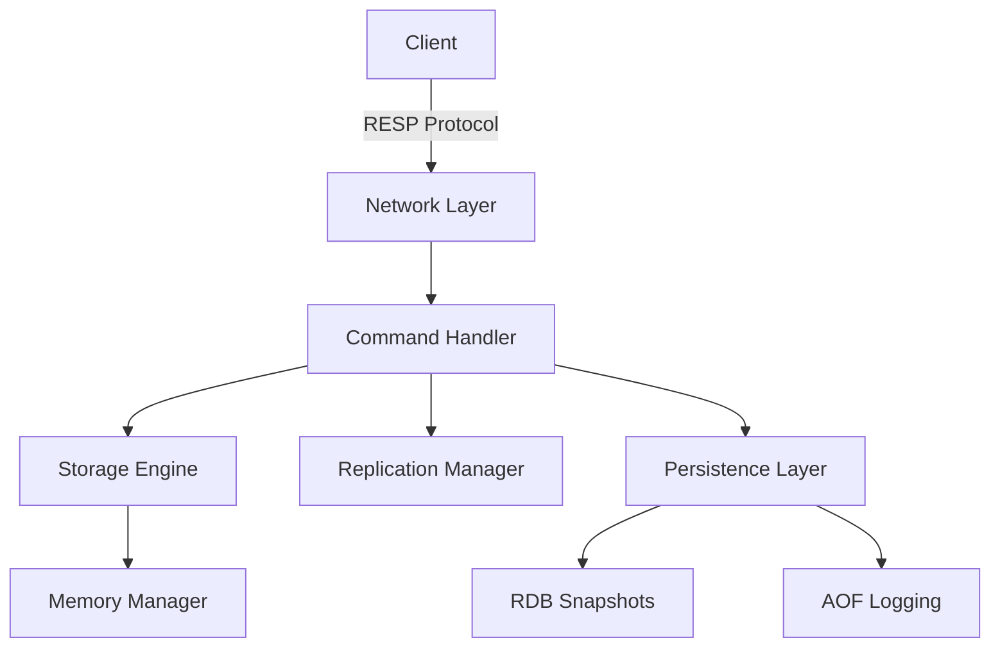

# Welcome to rLightning ⚡

A high-performance, Redis-compatible in-memory key-value store built in Rust, focused on session management and caching use cases.

## Why rLightning?

### Performance First
Built with Rust for maximum speed and memory safety. rLightning delivers exceptional performance with sub-millisecond latency for most operations.

### Redis Compatible
Drop-in replacement for Redis in many scenarios. Use your existing Redis clients and tools without modification.

### Production Ready
- **Multiple Data Types**: Strings, hashes, lists, sets, sorted sets
- **Persistence**: RDB snapshots and AOF logging
- **Replication**: Master-replica setup for high availability
- **Security**: Built-in authentication
- **Resource Management**: Configurable memory limits and eviction policies

## Quick Example

```bash
# Start the server
docker run -d -p 6379:6379 altista/rlightning:latest

# Connect with redis-cli
redis-cli -h localhost -p 6379

# Use it like Redis
SET user:1001:session "active"
EXPIRE user:1001:session 3600
GET user:1001:session
```

## Key Features

### 🚀 High Performance
- **200,000+ SET operations per second**
- **250,000+ GET operations per second**
- **Sub-millisecond latency**
- Lock-free data structures with DashMap
- Async I/O with Tokio

### 💾 Multiple Data Types
- **Strings**: Basic key-value storage with atomic operations
- **Hashes**: Field-value pairs for structured data
- **Lists**: Ordered collections with push/pop operations
- **Sets**: Unique member collections
- **Sorted Sets**: Scored sets for ranking and leaderboards

### ⏰ TTL Support
Automatic key expiration with configurable precision. Perfect for:
- Session management
- Cache invalidation
- Rate limiting
- Temporary data storage

### 🔄 Replication
Master-replica replication for:
- High availability
- Read scaling
- Disaster recovery
- Geographic distribution

### 💿 Persistence
Choose your persistence strategy:
- **RDB**: Point-in-time snapshots
- **AOF**: Append-only file for durability
- **Hybrid**: Best of both worlds
- **None**: Pure in-memory for maximum speed

### 🔒 Security
- Password-based authentication
- Client session tracking
- Secure by default configuration

### 📊 Resource Management
- Configurable memory limits
- Multiple eviction policies (LRU, Random, No Eviction)
- TTL-based automatic cleanup
- Memory usage monitoring

## Use Cases

### Session Management
Fast, reliable session storage for web applications with automatic expiration.

```bash
SET session:abc123 "user_data" EX 3600
```

### Caching Layer
Reduce database load by caching frequently accessed data.

```bash
SET cache:user:1001 "user_data" EX 300
GET cache:user:1001
```

### Rate Limiting
Track and limit request rates per user or IP.

```bash
INCR ratelimit:user:1001
EXPIRE ratelimit:user:1001 60
```

### Leaderboards
Use sorted sets for real-time rankings.

```bash
ZADD leaderboard 100 player1
ZADD leaderboard 200 player2
ZRANGE leaderboard 0 -1 WITHSCORES
```

### Message Queues
List-based job queues for task distribution.

```bash
LPUSH jobs "process_order:1001"
RPOP jobs
```

## Getting Started

Choose your installation method:

=== "Docker"
    ```bash
    docker run -d -p 6379:6379 altista/rlightning:latest
    ```

=== "Cargo"
    ```bash
    cargo install rlightning
    rlightning
    ```

=== "Source"
    ```bash
    git clone https://github.com/altista-tech/rLightning.git
    cd rLightning
    cargo build --release
    ./target/release/rlightning
    ```

[Get Started →](getting-started.md){ .md-button .md-button--primary }

## Architecture

rLightning is built with a modular, high-performance architecture:



[Learn More About Architecture →](architecture.md)

## Performance

rLightning is designed for high-performance scenarios:

| Operation | Throughput | Latency (p99) |
|-----------|-----------|---------------|
| SET       | 200K ops/s | 0.5ms         |
| GET       | 250K ops/s | 0.4ms         |
| HSET      | 180K ops/s | 0.6ms         |
| LPUSH     | 190K ops/s | 0.5ms         |
| ZADD      | 170K ops/s | 0.7ms         |

[View Detailed Benchmarks →](benchmarks.md)

## Community

Join the rLightning community:

- [GitHub Repository](https://github.com/altista-tech/rLightning)
- [Issue Tracker](https://github.com/altista-tech/rLightning/issues)
- [Discussions](https://github.com/altista-tech/rLightning/discussions)
- Email: support@altista.tech

## License

rLightning is open source software licensed under the [MIT License](https://opensource.org/licenses/MIT).
